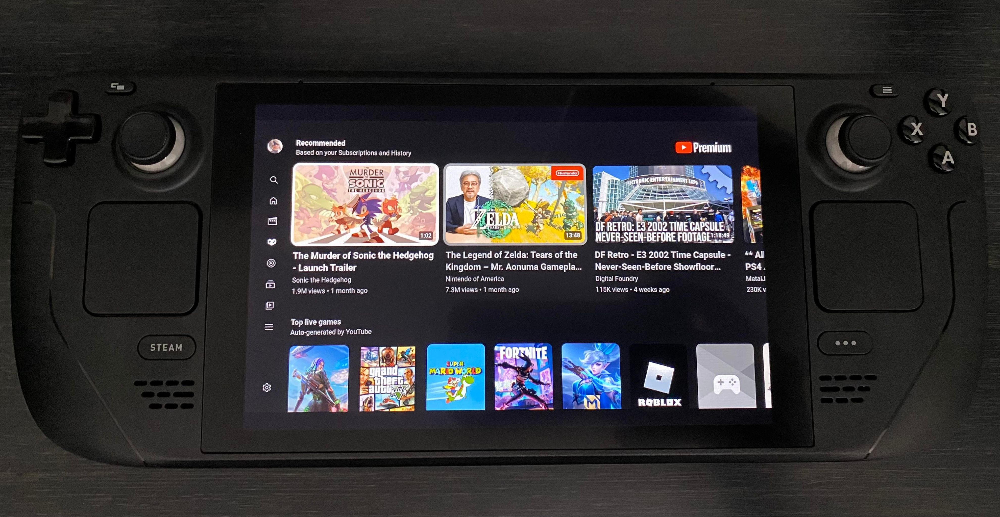

# Steam Deck - Youtube TV UI

This is a small program that allows you to use the Youtube TV UI on Steam Deck.

## How To Install

1. Head over to the ["Releases"](https://github.com/Daniel-Griffiths/steamdeck-youtube-tv/releases) tab and download the latest `.AppImage`
2. Download [AppImageLauncher](https://github.com/TheAssassin/AppImageLauncher/releases/download/v2.2.0/appimagelauncher-lite-2.2.0-travis995-0f91801-x86_64.AppImage), this is needed in order to add AppImages as non-steam games. https://github.com/TheAssassin/AppImageLauncher/releases/download/v2.2.0/appimagelauncher-lite-2.2.0-travis995-0f91801-x86_64.AppImage
3. Follow this very handy guide to get AppImageLauncher Installed, it also shows you how to add your own AppImages (Like the Youtube one) https://www.youtube.com/watch?v=3LxKAmYmMgE

Note: if you are upgrading from an older version you can rename the `.AppImage` to be the same as the previous version and overwrite it.

**Optional**

Download some banner images from streamgriddb to make it look a little better in game mode, these can be added from desktop mode. https://www.steamgriddb.com/search/grids?term=youtube
